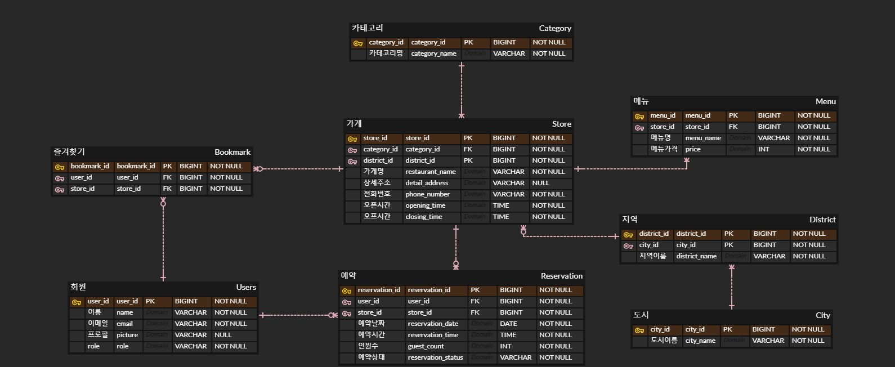

### 서비스 소개 
플레이스나우(PNOW)는 실시간으로 지역별 한식/중식/일식/양식/카페 검색, 즐겨찾기, 예약 서비스를 제공하는 웹 사이트입니다. 
      
### 개발 환경 
- **Java** : java 11
- **Editor** : Intellij IDEA
- **Build** : Gradle 8.3
- **Server Port Number** : 9091
- **Framework** : Springboot 2.7.17
- **Database** : h2 database(test용), AWS RDS MariaDB
- **CI & CD** : GitHub Actions
- **Server** : AWS EC2
- **Deploy** : Docker or AWS CodeDeploy
- **Library** :
  - SpringBoot Web 
  - Spring Data JPA 
  - Lombok 
  - Spring Security 
  - Oauth2-Client 
  - Validation 
  - Swagger 
  - Thymeleaf
      
      
### ERD 
      

### Swagger 
http://localhost:9091/swagger-ui/index.html       
      
      
### Endpoints 
      
**HOME**    
|HTTP|URI|설명|   
|:------:|:---:|:---:|   
|GET|/|홈페이지 조회|    
      
      
**USER**    
|HTTP|URI|설명|   
|:------:|:---:|:---:|   
|GET|/users|회원 정보 조회|   
|PUT|/users/{id}|회원 정보 수정|   
|DELETE|/users/{id}|회원 탈퇴|     
      
      
**STORE**    
|HTTP|URI|설명|   
|:------:|:---:|:---:|   
|GET|/stores|맛집 카테고리 페이지 조회|   
|GET|/stores/detail/{id}|가게 세부 정보 조회|   
|GET|/stores/category/{categoryId}/district/{districtId}|가게 목록 조회|    
|GET|/stores/search|가게 검색 조회|   
      
      
**RESERVATION**    
|HTTP|URI|설명|   
|:------:|:---:|:---:|   
|POST|/reservations|예약 등록|    
|DELETE|/reservations/{id}|예약 삭제|    
|GET|/reservations/stores/{storeId}|예약 페이지 조회|   
|GET|/reservations/{storeId}/availability/{reservationDate}|예약 가능 시간 목록 조회|   
|GET|/reservations/status/{status}|예약 목록 조회|
      
      
**BOOKMARK**    
|HTTP|URI|설명|   
|:------:|:---:|:---:|   
|DELETE|/bookmarks/{id}|즐겨찾기 삭제|   
|POST|/bookmarks/stores/{storeId}|즐겨찾기 등록|   
|GET|/bookmarks|즐겨찾기 목록 조회|    
      
      
**DISTRICT**    
|HTTP|URI|설명|   
|:------:|:---:|:---:|   
|GET|/districts/city/{cityId} |지역 목록 조회|   

     
[//]: # (Frontend   )

[//]: # (- Bootstrap 4.3.1)

[//]: # (- Thymeleaf 2.7.17    )

[//]: # (       )
[//]: # (Backend   )

[//]: # (- Spring Boot 2.7.17)

[//]: # (- Spring Security)

[//]: # (- Oauth2-Client 2.7.17)

[//]: # (- Spring Data JPA 2.7.17)

[//]: # (- Validation 2.7.17)

[//]: # (- Swagger 3.0.0)

[//]: # (     )
[//]: # (배포)

[//]: # (- Ec2)

[//]: # (- RDS : MariaDB)

[//]: # (- GitHub Actions)

[//]: # (- AWS CodeDeploy)