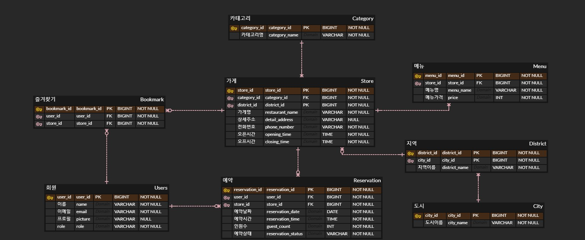

# 📖 < PNOW > 서비스 소개
플레이스나우(**PNOW**)는 **SpringBoot Framework** 로 개발한 토이 프로젝트로,   
음식점 예약 **CURD** 기능을 기반으로 **Spring Security + OAuth2 구글 소셜 로그인** 을 적용해     
**무중단 배포(AWS EC2)** 와 **CI/CD(Github Actions, AWS CodeDeploy)** 경험을 쌓아 보고자 개발한 프로젝트입니다.
    
개발된 기능으로는 실시간으로 예약 목록 확인 및 등록/취소를 할 수 있고, 현재 시간을 기준으로    
음식점이 영업중/영업준비중 인지와 즐겨찾기 및 검색 기능도 포함되어 있습니다.
      
## 💻 개발 환경 및 기술 스택

- **Java** : java 11
- **Editor** : Intellij IDEA
- **Build** : Gradle 8.3
- **Framework** : Springboot 2.7.17
- **Database** : h2 database(test용), AWS RDS MariaDB
- **CI & CD** : GitHub Actions 
- **Server** : AWS EC2
- **Deploy** : AWS CodeDeploy
- **Library** :
  - SpringBoot Web 
  - Spring Data JPA 
  - Lombok 
  - Spring Security 
  - Oauth2-Client 
  - Validation 
  - Swagger 
  - Thymeleaf
<!-- - **Server Port Number** : 9091 -->      
      
## 🙂 프로젝트 기간    
- 2024.02 ~ 2024.04(3개월) : AWS EC2 with Shell Script via SSH 수동 배포까지 완료
- 2025.11 : Github Action으로 CI/AWS CodeDeploy CD 배포 자동화

## 🧩 ERD 

#
## 💥 PNOW 서비스 화면

    
## ✨ Swagger 
http://localhost:9091/swagger-ui/index.html  

      
      
## ✔️ Endpoints 
      
**HOME**    
|HTTP|URI|설명|   
|:------:|:---:|:---:|   
|GET|/|홈페이지 조회|    
      
      
**USER**    
|HTTP|URI|설명|   
|:------:|:---:|:---:|   
|GET|/users|회원 정보 조회|   
|PUT|/users/{id}|회원 정보 수정|   
|DELETE|/users/{id}|회원 탈퇴|     
      
      
**STORE**    
|HTTP|URI|설명|   
|:------:|:---:|:---:|   
|GET|/stores|맛집 카테고리 페이지 조회|   
|GET|/stores/detail/{id}|가게 세부 정보 조회|   
|GET|/stores/category/{categoryId}/district/{districtId}|가게 목록 조회|    
|GET|/stores/search|가게 검색 조회|   
      
      
**RESERVATION**    
|HTTP|URI|설명|   
|:------:|:---:|:---:|   
|POST|/reservations|예약 등록|    
|DELETE|/reservations/{id}|예약 삭제|    
|GET|/reservations/stores/{storeId}|예약 페이지 조회|   
|GET|/reservations/{storeId}/availability/{reservationDate}|예약 가능 시간 목록 조회|   
|GET|/reservations/status/{status}|예약 목록 조회|
      
      
**BOOKMARK**    
|HTTP|URI|설명|   
|:------:|:---:|:---:|   
|DELETE|/bookmarks/{id}|즐겨찾기 삭제|   
|POST|/bookmarks/stores/{storeId}|즐겨찾기 등록|   
|GET|/bookmarks|즐겨찾기 목록 조회|    
      
      
**DISTRICT**    
|HTTP|URI|설명|   
|:------:|:---:|:---:|   
|GET|/districts/city/{cityId} |지역 목록 조회|   
