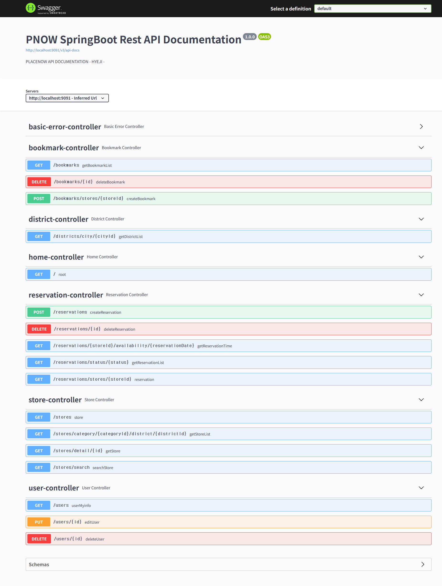

# 📖 PNOW (Place Now)

> **Spring Boot 기반 음식점 예약 서비스**  
> **CI/CD 자동 배포(AWS EC2, CodeDeploy)** 와  
> **OAuth2 소셜 로그인(Google)**, **Spring Security**, **JPA** 등을 활용한  
> **백엔드 개발 역량 강화를 위한 개인 프로젝트**입니다.    

📙 프로젝트 기술 문서 (Tistory Blog)

개발 과정, CI/CD 구축, 문제 해결 과정을 기록한 기술 블로그입니다.

🔧 **[ [CICD] Spring Boot + GitHub Actions + AWS CodeDeploy를 활용한 CI/CD 구축(1) ](https://choihjhj.tistory.com/entry/CICD-Spring-Boot-GitHub-Actions-AWS-CodeDeploy%EB%A5%BC-%ED%99%9C%EC%9A%A9%ED%95%9C-CICD-%EA%B5%AC%EC%B6%951)**

🔧 **[ [CICD] Spring Boot + GitHub Actions + AWS CodeDeploy를 활용한 CI/CD 구축(2) ](https://choihjhj.tistory.com/entry/CICD-Spring-Boot-GitHub-Actions-AWS-CodeDeploy%EB%A5%BC-%ED%99%9C%EC%9A%A9%ED%95%9C-CICD-%EA%B5%AC%EC%B6%952)**


---

## 🧭 프로젝트 개요

- **프로젝트명** : PNOW (Place Now)
- **개발 기간** : 2024.02 ~ 2025.11 
- **개발자** : 1인 개인 프로젝트
- **개발 목적** :  
  Spring Boot + AWS 환경에서 **자동 배포 CI/CD 파이프라인 구축 경험**과  
  OAuth2 기반 **보안 및 인증 시스템 설계** 능력 강화를 목표로 함.
- **핵심 기능** :
  - 음식점 예약 CRUD
  - 예약 가능 시간 조회
  - 실시간 영업 상태 표시 (영업 중 / 준비 중)
  - 즐겨찾기 / 검색 기능
  - Google OAuth2 로그인

---

## 🏗️ 시스템 아키텍처 및 기술 스택


### 💻 개발 환경
- **Language** : Java 11
- **Editor** : IntelliJ IDEA
- **Build Tool** : Gradle 8.3
- **Framework** : Spring Boot 2.7.17


### 🗄️ Database
- **테스트용** : H2 Database
- **운영용** : AWS RDS (MariaDB)


### ⚙️ CI / CD & Infrastructure
- **CI/CD** : GitHub Actions, AWS S3, AWS CodeDeploy
- **Server** : AWS EC2 t3.micro (Free Tier)
- **Storage** : Amazon S3 (배포 파일 및 정적 리소스 저장)


### 🔐 주요 라이브러리
- Spring Boot Web
- Spring Data JPA
- Lombok
- Spring Security
- OAuth2-Client (Google 소셜 로그인)
- Validation : 입력값 검증    
- Swagger : API 문서화    
- Thymeleaf : 서버 사이드 렌더링   
<!-- **Server Port Number** : 9091 -->     

---
## ☁️ 배포 파이프라인 (CI/CD)

> **GitHub → GitHub Actions → AWS S3 → AWS CodeDeploy → EC2**

1. GitHub에 push 발생 시 **GitHub Actions** 자동 빌드 실행
2. 빌드 결과(`.jar`)를 `.zip` 형태로 **AWS S3 업로드**
3. **AWS CodeDeploy**가 S3 파일을 EC2 인스턴스로 전달
4. **EC2에서 자동 배포 및 실행** 

---

## 🧩 ERD 구조


---

## 💥 서비스 주요 화면

| 메인 | 맛집 카테고리                                               | 예약                                                     | 예약 목록                                                 |
|------|-------------------------------------------------------|--------------------------------------------------------|-------------------------------------------------------|
|  |  |  |  |

| 즐겨찾기                                                  | 내 정보                                                   | 검색                                                     | 지난 예약 목록                                               |
|-------------------------------------------------------|--------------------------------------------------------|--------------------------------------------------------|--------------------------------------------------------|
|  |  |  |  |

> *사용자는 로그인 후 음식점을 검색, 예약, 즐겨찾기 할 수 있습니다.*

---
## ⚡ 트러블슈팅 (Troubleshooting)

### 1️⃣ GitHub Actions → CodeDeploy 배포 실패 (ZIP 파일 중복 생성 문제)
- **문제 상황** : GitHub Actions 빌드는 성공했으나 CodeDeploy 배포가 실패. deploy.yml 내부에서 ZIP 파일을 두 번 생성하는 중복 코드 발견
- **원인 분석** : deploy.yml 파일 내부에 두 ZIP 생성 코드가 동시에 존재
```yaml
      - name: Generate deployment package
        run: |
          mkdir -p before-deploy
          cp scripts/*.sh before-deploy/
          cp appspec.yml before-deploy/
          cp build/libs/*.jar before-deploy/
          cd before-deploy && zip -r before-deploy *
          cd ../ && mkdir -p deploy
          mv before-deploy/before-deploy.zip deploy/$PROJECT_NAME.zip
        shell: bash

      - name: Make zip file
        run: zip -r ./$PROJECT_NAME.zip .
         hell: bash
```
- **해결 방법** : 문제 중복 코드 완전 삭제, 필요한 파일만 모아 ZIP 생성.
```yaml
      - name: Generate deployment package
        run: |
          mkdir -p before-deploy
          cp scripts/*.sh before-deploy/
          cp appspec.yml before-deploy/
          cp build/libs/*.jar before-deploy/
          cd before-deploy && zip -r before-deploy *
          cd ../ && mkdir -p deploy
          mv before-deploy/before-deploy.zip deploy/$PROJECT_NAME.zip
        shell: bash
```
- **결과** : ZIP 구조가 CodeDeploy가 읽을 수 있는 정상 패키지 구조로 정리됨.
  PNOW.zip   
  ├── appspec.yml   
  ├── *.sh   
  └── *.jar
- **깨달은 점** : 중복 코드는 구조 충돌 발생을 일으킴

---

### 2️⃣ CodeDeploy “deploy.sh 파일 없음” 오류
- **문제 상황** : CodeDeploy는 아래 위치의 스크립트를 찾지 못해 배포 실패
```bash
ScriptMissing: scripts/deploy.sh not found
```
- **원인 분석** : appspec.yml에서 스크립트 경로를 잘못 지정
```yaml
hooks:
  ApplicationStart:
    - location: scripts/deploy.sh
```
그러나 실제 ZIP 구조는 다음과 같음:    
PNOW.zip   
├── appspec.yml   
├── deploy.sh   
└── *.jar
- **해결 방법** : `ZIP 파일 구조에 맞게 appspec.yml 수정
```yaml
permissions:
  - object: /home/ec2-user/app/step2/zip/
    pattern: "**"
    owner: ec2-user
    group: ec2-user

hooks:
  ApplicationStart:
    - location: deploy.sh
      runas: ec2-user
      timeout: 60

```
- **결과** : CodeDeploy가 정상적으로 deploy.sh를 실행, 배포 자동화 성공
- **깨달은 점** : 프로젝트 폴더 구조와 appspec.yml 배포 ZIP 구조는 완전히 별개. 혼동 주의
---

### 3️⃣ EC2 배포 성공했지만 Spring Boot 서버 구동 실패 (메모리 부족)
- **문제 상황** : 배포는 성공했으나 EC2 접속이 느려지고 서버 포트 접속 불가. Spring Boot가 시작되다가 중간에 멈춤.
- **원인 분석** :
  - 사용 인스턴스: t3.micro (1GB RAM)
  - Spring Boot + Hibernate + JPA 초기 구동 시 약 600~900MB 메모리 사용
  - nohup.out 로그에서 thread starvation, Hikari 경고 다수 발생
- **해결 방법** :
  - 임시 해결: Swap 메모리 2GB 생성
  ```bash
  sudo fallocate -l 2G /swapfile
  sudo chmod 600 /swapfile
  sudo mkswap /swapfile
  sudo swapon /swapfile
  echo '/swapfile swap swap defaults 0 0' | sudo tee -a /etc/fstab
  ```
  - build.gradle 수정 (H2 의존성 runtime으로 들어가 불필요한 메모리 소모)
  ```gradle
  // 수정 전
  runtimeOnly 'com.h2database:h2'

  // 수정 후
  testRuntimeOnly 'com.h2database:h2'
  ```      
- **결과** : Spring Boot 정상 기동, EC2 서버 정상 응답
- **깨달은 점** : AWS EC2 프리티어(t3.micro)는 Spring Boot 서버 띄우기엔 부족함. EC2 용량 업그레이드 필요.

---
## 🚀 기술적 성취

✅ **자동 배포 환경 구성**
- GitHub Actions + S3 + CodeDeploy 조합으로 CI/CD 구축
- EC2에 배포 자동화 스크립트 작성 및 서비스 재기동 자동화

✅ **보안 및 인증**
- Spring Security를 통한 사용자 인증/인가 처리
- OAuth2 Google 소셜 로그인 구현

✅ **데이터 관리**
- Spring Data JPA 기반의 도메인 설계 및 트랜잭션 관리
- H2를 통한 테스트 환경과 MariaDB 운영 환경 분리

✅ **문서화 및 협업 툴**
- Swagger를 통한 REST API 문서 자동화

---
## 🧠 프로젝트 회고
> Spring Boot와 AWS를 연동하는 과정을 통해 단순한 백엔드 개발을 넘어   
> **실제 서비스의 배포·운영 환경을 직접 구축**하며 DevOps 전반을 깊이 이해할 수 있었던 프로젝트입니다.    
> CI/CD 자동화, 보안 설정, 데이터베이스 구성 등 **서비스 운영에 필요한 전 과정**을 직접 경험하면서    
> 작은 설정 하나가 전체 배포 프로세스에 큰 영향을 줄 수 있다는 점을 체감했습니다.
>
> 특히 CI/CD에서는 **경로·파일 구조·권한 설정**과 같은 기본적인 요소가 얼마나 중요한지 알게 되었고,     
> 또한 **Spring Boot + JPA + Hibernate** 플리케이션을 안정적으로 운영하기 위해서는     
> 최소 **t3.small (2GB RAM) 이상** 이상의 서버 스펙이 필요하다는 점도 트러블슈팅을 통해 확인했습니다.
>
> 이번 경험을 통해 기능 개발뿐만 아니라     
> **배포, 운영, 서버 용량, 성능, 인프라까지 함께 고려할 수 있는 개발자**의 중요성을 깨달았습니다.  
> 앞으로는 앞으로는 꾸준히 경험을 쌓아        
> **안정적인 서비스를 끝까지 책임질 수 있는 개발자**가 되겠습니다.

---
## 🔮 향후 개선 방향
- [ ] **Docker + Nginx** 기반 무중단 Blue/Green 배포 구현
- [ ] **Redis** 캐시 적용으로 예약 처리 속도 향상
- [ ] **EC2 인스턴스** 용량 업그레이드로 안정적 배포

---

## ✨ Swagger API Docs

- **Swagger UI** : [http://ec2-15-165-144-6.ap-northeast-2.compute.amazonaws.com:9091/swagger-ui/index.html](http://localhost:9091/swagger-ui/index.html)

<details>
  <summary>📘 Swagger UI 미리보기 (클릭해서 보기)</summary>


  

</details>

---

## 📚 API Endpoints 요약

| 구분 | HTTP | URI | 설명             |
|------|:----:|:----|:---------------|
| **HOME** | GET | `/` | 홈페이지 조회        |
| **USER** | GET | `/users` | 회원 정보 조회       |
| | PUT | `/users/{id}` | 회원 정보 수정       |
| | DELETE | `/users/{id}` | 회원 탈퇴          |
| **STORE** | GET | `/stores` | 맛집 카테고리 페이지 조회 |
| | GET | `/stores/detail/{id}` | 가게 세부 정보 조회    |
| | GET | `/stores/category/{categoryId}/district/{districtId}` | 가게 목록 조회       |
| | GET | `/stores/search` | 가게 검색          |
| **RESERVATION** | POST | `/reservations` | 예약 등록          |
| | DELETE | `/reservations/{id}` | 예약 삭제          |
| | GET | `/reservations/stores/{storeId}` | 예약 페이지 조회      |
| | GET | `/reservations/{storeId}/availability/{reservationDate}` | 예약 가능 시간 목록 조회 |
| | GET | `/reservations/status/{status}` | 예약 목록 조회       |
| **BOOKMARK** | POST | `/bookmarks/stores/{storeId}` | 즐겨찾기 등록        |
| | GET | `/bookmarks` | 즐겨찾기 목록 조회     |
| | DELETE | `/bookmarks/{id}` | 즐겨찾기 삭제        |
| **DISTRICT** | GET | `/districts/city/{cityId}` | 지역 목록 조회       |

---

<!--
# 📖 < PNOW > 서비스 소개
플레이스나우(**PNOW**)는 **SpringBoot Framework** 로 개발한 토이 프로젝트로,   
음식점 예약 **CURD** 기능을 기반으로 **Spring Security + OAuth2 구글 소셜 로그인** 을 적용해     
**무중단 배포(AWS EC2)** 와 **CI/CD(Github Actions, S3, AWS CodeDeploy)** 경험을 쌓아 보고자 개발한 프로젝트입니다.
    
개발된 기능으로는 실시간으로 예약 목록 확인 및 등록/취소를 할 수 있고, 현재 시간을 기준으로    
음식점이 영업중/영업준비중 인지와 즐겨찾기 및 검색 기능도 포함되어 있습니다.
      
## 🏗️ 시스템 아키텍처 및 기술 스택
      
💻 개발 환경     
- **Language** : java 11
- **Editor** : Intellij IDEA
- **Build Tool** : Gradle 8.3
- **Framework** : Springboot 2.7.17        
  🗄️ Database     
- **테스트용** : H2 Database
- **운영용** : AWS RDS (MariaDB)     
  ⚙️ CI / CD & Infrastructure       
- **CI & CD** : : GitHub Actions, AWS S3, AWS CodeDeploy
- **Server** : AWS EC2
- **Storage** : Amazon S3 (배포 파일 및 정적 리소스 저장)
  🔐 주요 라이브러리
- **Library** :
  - SpringBoot Web 
  - Spring Data JPA 
  - Lombok 
  - Spring Security 
  - Oauth2-Client 
  - Validation 
  - Swagger 
  - Thymeleaf
- **Server Port Number** : 9091     
      
## 🙂 프로젝트 기간    
- 2024.02 ~ 2024.04(3개월) : AWS EC2 with Shell Script via SSH 수동 배포까지 완료
- 2025.11 : Github Actions(CI) -> 압축파일(.zip)을 AWS S3에 업로드 -> AWS CodeDeploy를 이용해 배포(CD)

-->